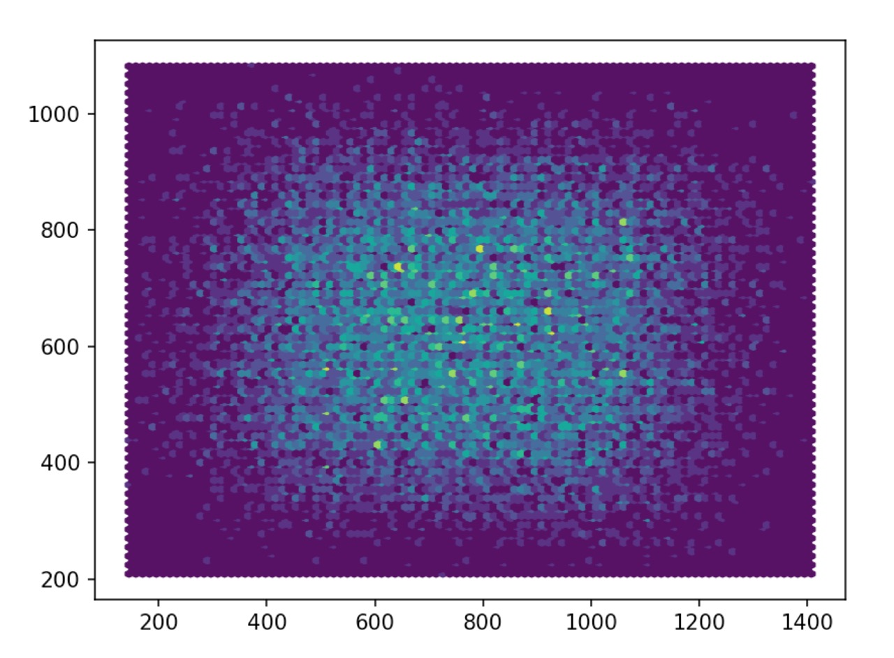

# # SaltWaterDistortion Dataset

SWD (Salt Water Distortion) dataset is the new image dataset in order to underwater distortion estimation and correction. 
Images were collected in water of various salinity (<1%, 13%, 25%, 40%) via two smartfone cameras with different angle of view and focal lengths. New dataset includes 689 underwater photos of calibration chessboard, for each image all corners of the chessboard squares were manually marked (35,748 corners in total).

## Online Repository link

* [DataRepository](ftp://vis.iitp.ru/SWD/) - Link to the data repository.

### Files formats

Photos format: .jpg
Markup files format: .json

### Description of the data

In root directory there are two directories correspondending to two cameras: main and wide. Each of these main directories includes five other ones including photos made in different environments, its markup and calibration params found using cross validation with classical calibration method.
Name of markup file corresponding to the image is formed by concatenating to the image name ".json" extension.
Some directories include the "bad" directory, that includes manually excluded photos (blurry or with light highlights).

```
-SWD/
    -main/
        -air/
            -photos/
                -photo1.jpg
                -photo2.jpg
                -...
                -bad/

            -markup/
                -photo1.jpg.json
                -photo1.jpg.json
                -...
            -cam_params.yml
        -no_salt/
            -photos/
                -photo1.jpg
                -photo2.jpg
                -...
            -markup/
                -photo1.jpg.json
                -photo1.jpg.json
                -...
            -cam_params.yml
        -...
    -wide/
        -...
-README.md
```

### Description of the markup

Coordinates of the corners of the chessboard squares were detected for each image by hand. Each point coordinates were marked with subpixel accuracy. Depending on the situation to the prototype corner of the chessboard square was set into correspondence either the point in the middle of the pixel or the point of pixel lattice or the point in the middle of side between two neighboring pixels.

Markup file includes information of coords of all 54 internal corners of the chessboard squares. The corners are numbered horizontally from upper left to lower right, i.e. in the top row from left to right located numbers from 1 to 9, in the second row from 10 to 18, etc.

The example of the markup:
```
{
  "objects": [
    {
      "data": [
        498.4531249999999,
        449.5624999999999
      ],
      "tags": [
        "1"
      ],
      "type": "point"
    },
    ...
    {
      "data": [
        1094.9990448411927,
        851.0030111580097
      ],
      "tags": [
        "54"
      ],
      "type": "point"
    }
  ],
  "size": [
    1459,
    1094
  ]
}
```
### Description of the calibration params

Calibration params are stored in json-format. It contain the following information: camera matrix, distortion coefficients, projection matrix, rectification matrix, distortion model, image height, image width. Matrices contain next fields: rows, cols and data, which allow us to read and use it easily.

{
	"camera_matrix" : 
	{
		"cols" : 3,
		"data" : 
		[
			1521.8377924562817,
			0,
			731.01211191674577,
			0,
			1521.8377924562817,
			545.93222920448102,
			0,
			0,
			1
		],
		"rows" : 3
	},
	"distortion_coefficients" : 
	{
		...
	},
	"distortion_model" : "rational_polynomial",
	"image_height" : 1094,
	"image_width" : 1459,
	"projection_matrix" : 
	{
    ...
	},
	"rectification_matrix" : 
	{
		...
	}
}

### Description of the images

The shooting was done by using modern smartphone Huawei Mate 20 Pro. Data was collected on two cameras: normal (focal lenght 2.35 mm) and wide-angle cameras (focal lenght 7.48 mm). Image size is same for both cameras and is 1459 х 1094 pixels. Chessboard was used as calibration object. Chessboard size is 13х9.1 centimeters and chessboard square side length is 1.3 cm (10х7 squares).
The underwater shooting was done by using aquarium with tap water (salnity less than 1%). Collected fresh water dataset includes 62 and 56 images for each camera respectively. Then salnity was increased using table salt to 13, 27 and 40%. Obtained salt water datasets includes respectively 45, 85, 91 images for normal angle camera and 47, 89, 80 images for wide-angle camera.

## Specificity of the images

Thanks to the some technical dificulties faced during data collection, there are some specificity:

* After smartphone camera shutter releasing the image was processed programmatically from RAW format. After it the final image was cropped, but it was not showed on the screen at the moment of shooting. For that reason chessboard obtaining on the image edge, where the distortion is known to be maximum, was hindered.  

An example of the gistogramm of the chessboard squares corners distribution in the original image is shown in figure.


* Because of water moving during camera shutter releasing and image processing many of the images were blurry. Those images were had to exclude because of the blurrity some corners of the chessboard squares became indistinguishable. 

* As the salnity increased the blurrity increased, because of not enough purity of the used salt and it contained some admixture.

* For the underwater shooting laminated paper with the chessboard image was used. Because of it some light highlights appeared at certain angles. Particularly if it prevented determination of some corners of the chessboard squares, the images were excluded by hand.

<!-- 
## Authors -->

<!-- * **authorname** - *Initial work* - [smartblond](https://github.com/smartblond) -->

<!-- See also the list of [contributors](https://github.com/your/project/contributors) who participated in this project. -->
